---
## Front matter
lang: ru-RU
title: Лабораторная работа 1
author:
  - Крухмалев А.В.
institute:
  - Российский университет дружбы народов, Москва, Россия
date: 16 февраля 2023

## i18n babel
babel-lang: russian
babel-otherlangs: english

## Formatting pdf
toc: false
toc-title: Содержание
slide_level: 2
aspectratio: 169
section-titles: true
theme: metropolis
header-includes:
 - \metroset{progressbar=frametitle,sectionpage=progressbar,numbering=fraction}
 - '\makeatletter'
 - '\beamer@ignorenonframefalse'
 - '\makeatother'
---

## Цель работы

Приобретение практических навыков установки операционной системы на виртуальную машину, настройки минимально необходимых для дальнейшей работы сервисов.

## Задание

Необходимо установить операционную систему Linux на виртуальную машину, а также необходимые для дальнейшей работы программы.

# Выполнение лабораторной работы

## Запустим виртуальную машину и нажмем кнопку создать

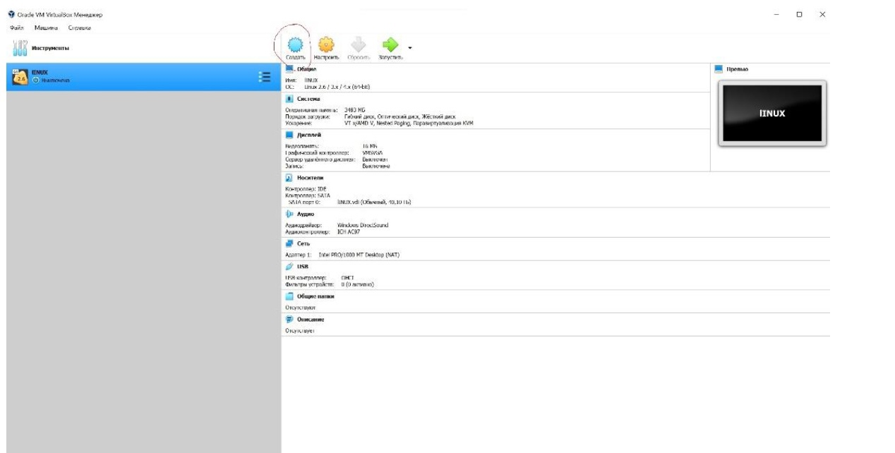{ #fig:001 width=40% }

## Bведем название нашей ОС и выберем диск установки

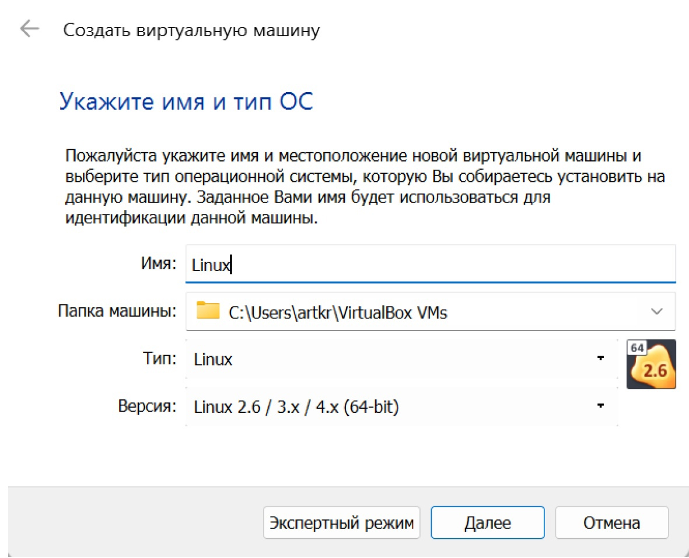{ #fig:002 width=40% }

## Выделим необходимый объем оперативной памяти, 3,5ГБ будет достаточно 

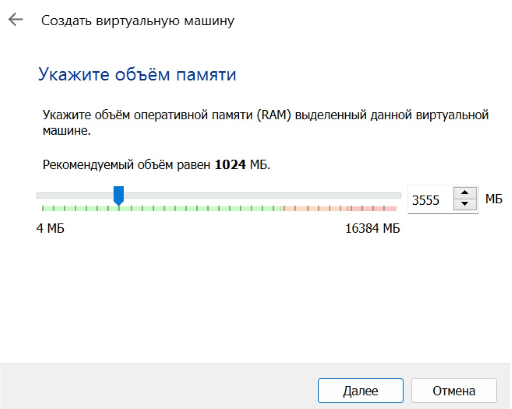{ #fig:003 width=40% }

## Далее создадим виртуальный жесткий диск

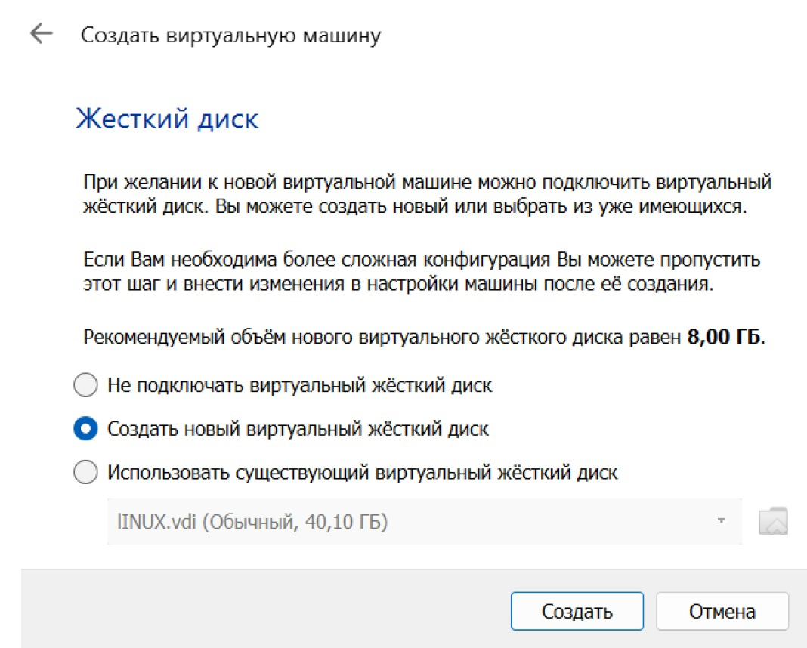{ #fig:004 width=40% }

## Выбор размера диска

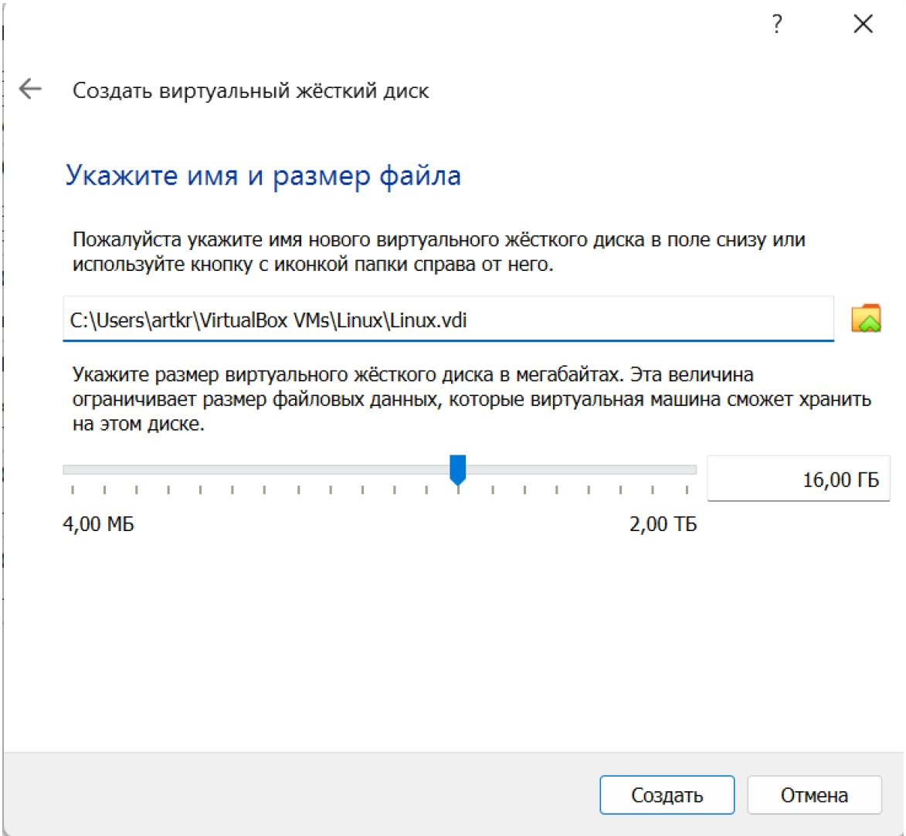{ #fig:006 width=40% }

## перейдем к установке дистрибутива Fedora

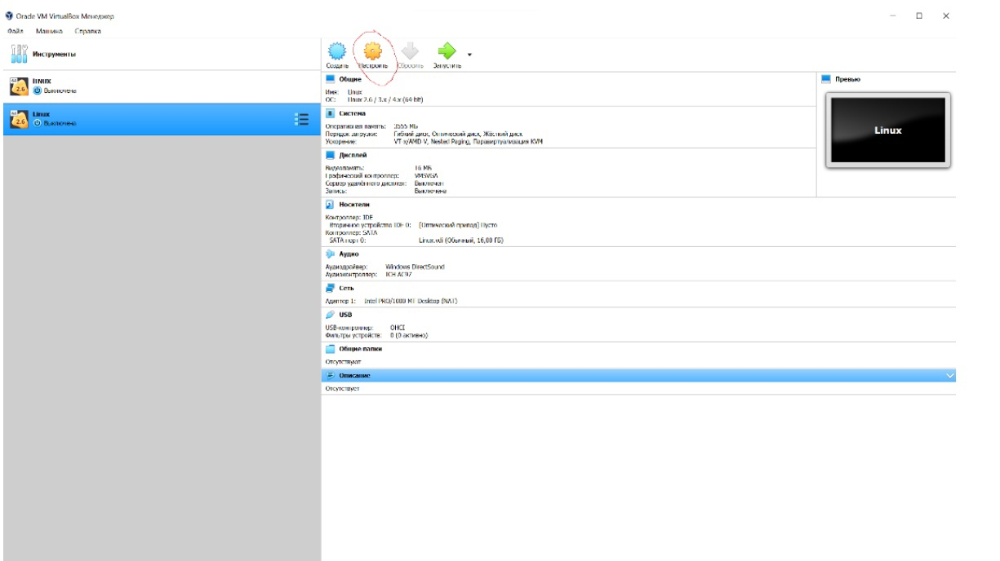{ #fig:007 width=40% }

## Запустим образ, у нас появится дисковод

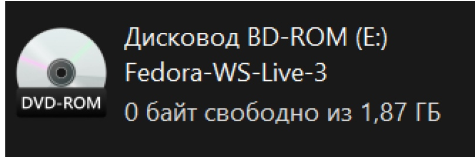{ #fig:009 width=40% }

## Выберем в носителях диск скачки

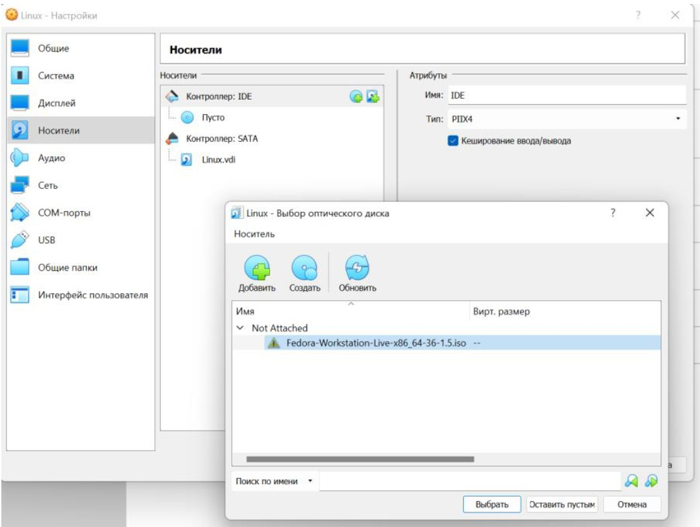{ #fig:011 width=40% }

## Запустим Linux

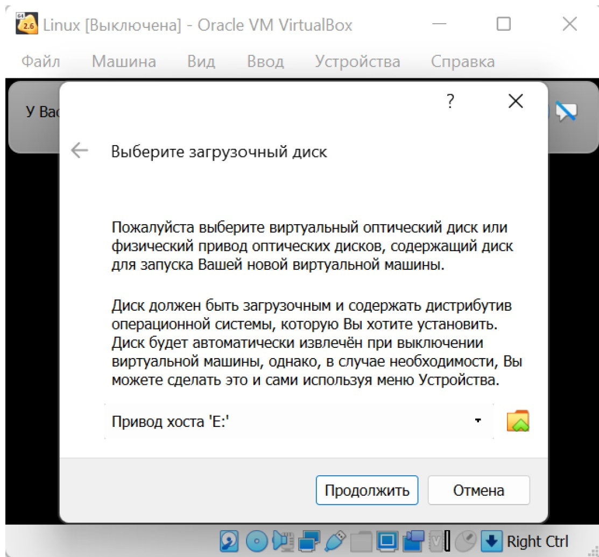{ #fig:012 width=40% }

## В окне установке выберем instal to hard drive

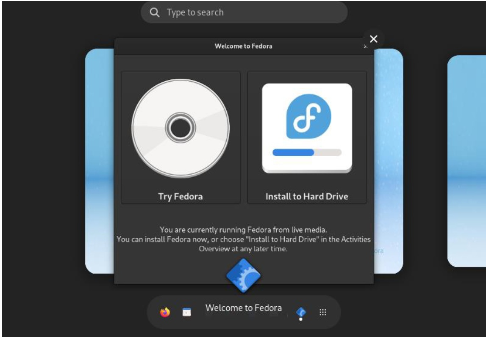{ #fig:013 width=40% }

- Выберем язык и часовой пояс, Выберем место установки, Выбираем наш жесткий диск и завершаем первичную настройку, теперь ждем пока установится образ, После установки перезаходим в Linux, не забывая убрать в носитилях виртуальный диск, иначе установка пойдет заново. Создаем учетную запись.

# Самостоятельная работа

## Установим необходимые программы.

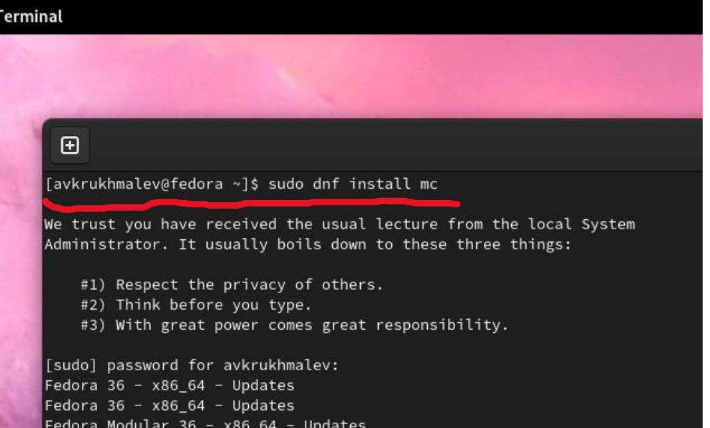{ #fig:015 width=40% }
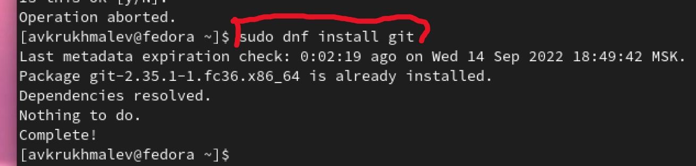{ #fig:016 width=40% }
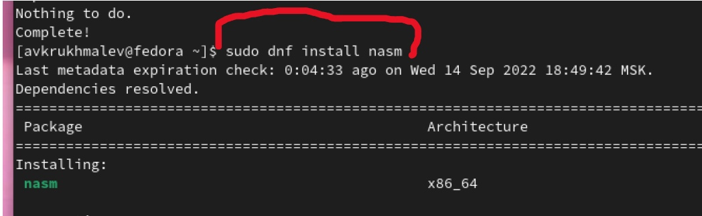{ #fig:017 width=40% }

## Выведем команду dmesg 

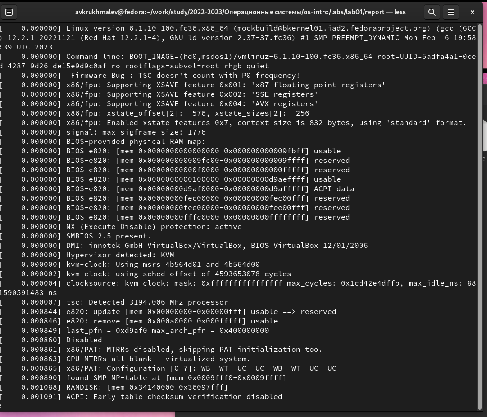{ #fig:018 width=40% }
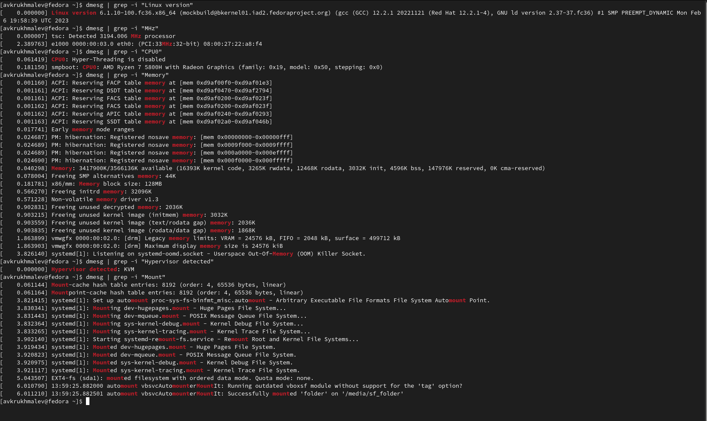{ #fig:019 width=40% }

## Выводы

Я познакомился с операционной системой Linux и дистрибутивом Fedora основанным на ней, установил её на виртуальную машину, запустил терминал и с его помощью установил Midnight Commander, Git, NASM.

