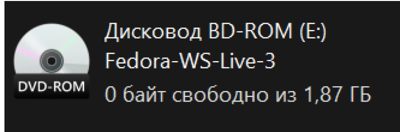

---
## Front matter
title: "Лаборная работа №1"
subtitle: "НММ-бд-02-22"
author: "Крухмалев Артём Владиславович"

## Generic otions
lang: ru-RU
toc-title: "Содержание"

## Bibliography
bibliography: bib/cite.bib
csl: pandoc/csl/gost-r-7-0-5-2008-numeric.csl

## Pdf output format
toc: true # Table of contents
toc-depth: 2
fontsize: 12pt
linestretch: 1.5
papersize: a4
documentclass: scrreprt
## I18n polyglossia
polyglossia-lang:
  name: russian
  options:
	- spelling=modern
	- babelshorthands=true
polyglossia-otherlangs:
  name: english
## I18n babel
babel-lang: russian
babel-otherlangs: english
## Fonts
mainfont: PT Serif
romanfont: PT Serif
sansfont: PT Sans
monofont: PT Mono
mainfontoptions: Ligatures=TeX
romanfontoptions: Ligatures=TeX
sansfontoptions: Ligatures=TeX,Scale=MatchLowercase
monofontoptions: Scale=MatchLowercase,Scale=0.9
## Biblatex
biblatex: false
biblio-style: "gost-numeric"
biblatexoptions:
  - parentracker=true
  - backend=biber
  - hyperref=auto
  - language=auto
  - autolang=other*
  - citestyle=gost-numeric
## Pandoc-crossref LaTeX customization
figureTitle: "Рис."
tableTitle: "Таблица"
listingTitle: "Листинг"
lofTitle: "Список иллюстраций"
lotTitle: "Список таблиц"
lolTitle: "Листинги"
## Misc options
indent: true
header-includes:
  - \usepackage{indentfirst}
  - \usepackage{float} # keep figures where there are in the text
  - \floatplacement{figure}{H} # keep figures where there are in the text
---

# Цель работы

Приобретение практических навыков установки операционной системы на виртуальную машину, настройки минимально необходимых для дальнейшей работы сервисов.

# Задание

Необходимо установить операционную систему Linux на виртуальную машину, а также необходимые для дальнейшей работы программы.

# Выполнение лабораторной работы

1. Запустим виртуальную машину и нажмем кнопку создать

{ #fig:001 width=70% }

2. Введем название нашей ОС и выберем диск установки

{ #fig:002 width=70% }

3. Выделим необходимый объем оперативной памяти, 3,5ГБ будет достаточно 

{ #fig:003 width=70% }

4. Далее создадим виртуальный жесткий диск

{ #fig:004 width=70% }

5. Выбор типа диска

![Тип диска] (image/5.jpg){ #fig:005 width=70% }

6. Выбор размера диска

{ #fig:006 width=70% }

7. Далее перейдем к установке дистрибутива Fedora, скачаем с официального сайта образ и перейдем к настройкам 

{ #fig:007 width=70% }

8. Запустим образ, у нас появится дисковод

{ #fig:009 width=70% }

9. Выберем в носителях диск скачки

{ #fig:011 width=70% }

10. Запустим Linux

{ #fig:012 width=70% }

11. В окне установке выберем instal to hard drive

{ #fig:013 width=70% }

12. Выберем язык и часовой пояс, Выберем место установки, Выбираем наш жесткий диск и завершаем первичную настройку, теперь ждем пока установится образ, После установки перезаходим в Linux, не забывая убрать в носитилях виртуальный диск, иначе установка пойдет заново. Создаем учетную запись.

{ #fig:014 width=70% }

# Самостоятельная работа

1. Установим необходимые программы.

{ #fig:015 width=70% }

{ #fig:016 width=70% }

{ #fig:017 width=70% }

2. Выведем команду dmesg 

{ #fig:018 width=70% }

3. Теперь выведем остальные запросы

{ #fig:018 width=70% }

# Контрольные вопросы

1. Какую информацию содержит учётная запись пользователя?
Индентификационный номер пользвателя (UID)
Индентификационный номер группы (GID)
Пароль (password)
Полное имя (full name)
Домашний каталог (home directory)
Начальную оболочку (login shell)

2. Укажите команды терминала и приведите примеры:

для получения справки по команде;
-help
для перемещения по файловой системе;
cd /home cd work = /home/work
для просмотра содержимого каталога;
ls ls work=study
для определения объёма каталога;
du
для создания / удаления каталогов / файлов;
mkdir -создание, rm -r - удаление
для задания определённых прав на файл / каталог;
touch/rm
для просмотра истории команд.
history

3. Что такое файловая система? Приведите примеры с краткой характеристикой.
Файловая система - порядок, определяющий способ организации,хранения и наименования данных на носителях иации в пк, а также в другом электронном оборудовании. Файловая система определяет формат содержимого и способ физического хранения информации,

4. Как посмотреть, какие файловые системы подмонтированы в ОС?
Df - утилита, показывающая список всех файловых систем по имени устройства, сообщает их размер, занятое и свободное пространство и точки монтирования. При выполнении бещ аргумента, команда mount выведет все подключенные данные.

5. Как удалить зависший процесс?
С помощью команды killall-killall ().

# Выводы

Я познакомился с операционной системой Linux и дистрибутивом Fedora основанным на ней, установил её на виртуальную машину, запустил терминал и с его помощью установил Midnight Commander, Git, NASM.

:::
