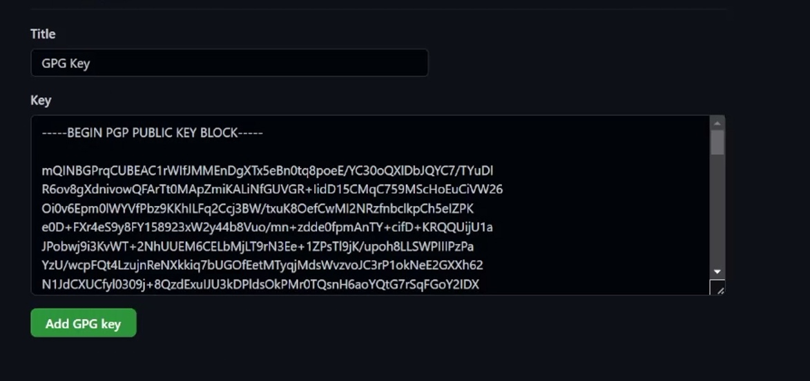

---
## Front matter
title: "Лаборная работа №2"
subtitle: "НММ-бд-02-22"
author: "Крухмалев Артём Владиславович"

## Generic otions
lang: ru-RU
toc-title: "Содержание"

## Bibliography
bibliography: bib/cite.bib
csl: pandoc/csl/gost-r-7-0-5-2008-numeric.csl

## Pdf output format
toc: true # Table of contents
toc-depth: 2
fontsize: 12pt
linestretch: 1.5
papersize: a4
documentclass: scrreprt
## I18n polyglossia
polyglossia-lang:
  name: russian
  options:
	- spelling=modern
	- babelshorthands=true
polyglossia-otherlangs:
  name: english
## I18n babel
babel-lang: russian
babel-otherlangs: english
## Fonts
mainfont: PT Serif
romanfont: PT Serif
sansfont: PT Sans
monofont: PT Mono
mainfontoptions: Ligatures=TeX
romanfontoptions: Ligatures=TeX
sansfontoptions: Ligatures=TeX,Scale=MatchLowercase
monofontoptions: Scale=MatchLowercase,Scale=0.9
## Biblatex
biblatex: false
biblio-style: "gost-numeric"
biblatexoptions:
  - parentracker=true
  - backend=biber
  - hyperref=auto
  - language=auto
  - autolang=other*
  - citestyle=gost-numeric
## Pandoc-crossref LaTeX customization
figureTitle: "Рис."
tableTitle: "Таблица"
listingTitle: "Листинг"
lofTitle: "Список иллюстраций"
lotTitle: "Список таблиц"
lolTitle: "Листинги"
## Misc options
indent: true
header-includes:
  - \usepackage{indentfirst}
  - \usepackage{float} # keep figures where there are in the text
  - \floatplacement{figure}{H} # keep figures where there are in the text
---

# Цель работы

Познакомиться с системой git, а также сайтом github.

# Задание

Настроить GitHub, создать репозиторий и каталог курса.

# Выполнение лабораторной работы

1. Создадим профиль на github

{ #fig:001 width=70% }

2.Настроим гит.

{ #fig:002 width=70% }

3. Создадим SSH key.

{ #fig:003 width=70% }

4. Занесем ключ в гитхаб

{ #fig:004 width=70% }

5. Создадим ключ pgp. Для этого выберем его параметры

![Параметры pgp ключа] (image/5.jpg){ #fig:005 width=70% }

6. Вывод pgp следа. Публичного и скрытого.

{ #fig:006 width=70% }

7. С помощью команды gpg --armor --export <PGP Fingerprint> | xclip -sel clip скопируем ключ и вставим его в гитхаб.

{ #fig:007 width=70% }

8. Настроим автоматические подписи в гите.

{ #fig:009 width=70% }

9. Привяжем устройство к гитхабу и скопируем новый репозиторий в свой гит.

{ #fig:011 width=70% }

10. Далее скопируем новый репозиторий к себе на устройство.

{ #fig:012 width=70% }

11. Настроим новый репозиторий, удалив лишние папки и добавив новые.

{ #fig:013 width=70% }

# Контрольные вопросы

1. Что такое системы контроля версий (VCS) и для решения каких задач они предназначаются?
Система, позволяющая работать нескольким людям над одним проектом, вносить коректировки, сохранять старые версии.
2. Объясните следующие понятия VCS и их отношения: хранилище, commit, история, рабочая копия.
Хранилище - директория, в которой хранится проект; коммит - текущее состояние рабочей копии; история - последовательность коммитов в порядке, в котором они добавлялись в репозиторий; рабочая копия - текущее состояние репозитория, которое находится в состоянии изменения.
3. Что представляют собой и чем отличаются централизованные и децентрализованные VCS? Приведите примеры VCS каждого вида.
В централизованных VCS (Mercurial) все пользователи подключены к единому серверу; в децентрализованных VCS пользователи подключены к нескольким владельцам.
4. Опишите действия с VCS при единоличной работе с хранилищем.
При единоличной работе с хранилищем все изменения, созданные пользователем, не влияют на общий репозиторий.
5. Опишите порядок работы с общим хранилищем VCS.
Из общего хранилища можно получать изменения проекта.
6. Каковы основные задачи, решаемые инструментальным средством git?
git позволяет несольким людям работать над одним проектом.
7. Назовите и дайте краткую характеристику командам git.
add - добавить файлы в коммит, push - отправить коммит на удалённый репозиторий; pull - импортировать проект с удалённого репозитория.
8. Приведите примеры использования при работе с локальным и удалённым репозиториями.
Локальный репозиторий — она же директория “.git”. В ней хранятся коммиты и другие объекты. Удаленный репозиторий – тот самый репозиторий который считается общим, в который вы можете передать свои коммиты из локального репозитория, что бы остальные программисты могли их увидеть. Удаленных репозиториев может быть несколько, но обычно он бывает один.
9. Что такое и зачем могут быть нужны ветви (branches)?
Создав новую ветвь, можно, не вредя проекту, работать над конкретной частью проекта.
10. Как и зачем можно игнорировать некоторые файлы при commit?
Некоторые файлы могут быть ненужгыми для пользователя.

# Выводы

В данной лабораторной работе мы познакомились с github и каталогами, провели их настройку. Добавили прошлые работы в каталоге с помощью терминала.

:::
