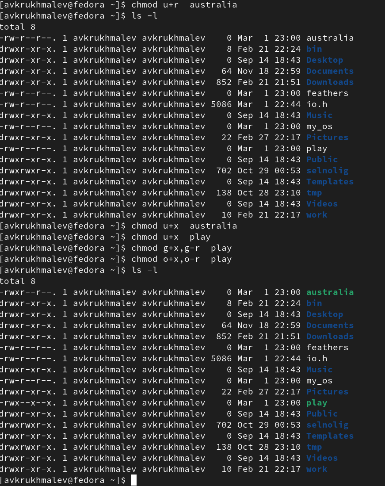

---
## Front matter
lang: ru-RU
title: Лабораторная работа 5
author:
  - Крухмалев А.В.
institute:
  - Российский университет дружбы народов, Москва, Россия
date: 2 марта 2023

## i18n babel
babel-lang: russian
babel-otherlangs: english

## Formatting pdf
toc: false
toc-title: Содержание
slide_level: 2
aspectratio: 169
section-titles: true
theme: metropolis
header-includes:
 - \metroset{progressbar=frametitle,sectionpage=progressbar,numbering=fraction}
 - '\makeatletter'
 - '\beamer@ignorenonframefalse'
 - '\makeatother'
---

## Цель работы

Ознакомление с файловой системой Linux, её структурой, именами и содержанием каталогов. Приобретение практических навыков по применению команд для работы с файлами и каталогами, по управлению процессами (и работами), по проверке использования диска и обслуживанию файловой системы.

## Задание

Приобретение практических навыков взаимодействия пользователя с командами, каталогами и файлами.

# Выполнение лабораторной работы

## Первоначально изучим и перепишем примеры из самой работы.

{ #fig:001 width=70% }

## Перейдем в каталог usr и перенесем файл io.h в домашний каталог .

{ #fig:002 width=70% }

## C помощью простейших команд создадим каталог и перенесм в него файл и перемсенуем.

{ #fig:003 width=70% }

## C помощью уже известных команд mkdir, mv и cp выполним оставшуюся часть этого блока.

{ #fig:004 width=70% }

## Посмотрим как выглядит каталог внутри файловой системы.

![Вид файлов] (image/5.png){ #fig:005 width=70% }

## С помощью команды chmod зададим необходимые права файлам

{ #fig:006 width=70% }

## Итоговый вид всех файлов.

{ #fig:007 width=70% }

## Далее выполним множество несложных команд, все их можно увидеть на рисунке. Также если у файла или каталога отобрать права на чтение, то после команды сат будет ошибка, что у нас нет прав, Такая же ситуация с переходом в каталог, если отобрать права на выполнение.

{ #fig:009 width=70% }

## Далее c помощью команды man выведем несколько команд.

mount-Команда mount служит для присоединения файловой системы, найденной на каком-либо устройстве, к большому файловому дереву.
fsck- Проверяет файловую систему на целостность и ошибки. 
mkfs- mkfs используется для создания файловой системы Linux на устройстве, обычно это раздел жесткого диска.
kill-убить процесс 

## Выводы

Я научился работать с командами для файлов и каталогов 

