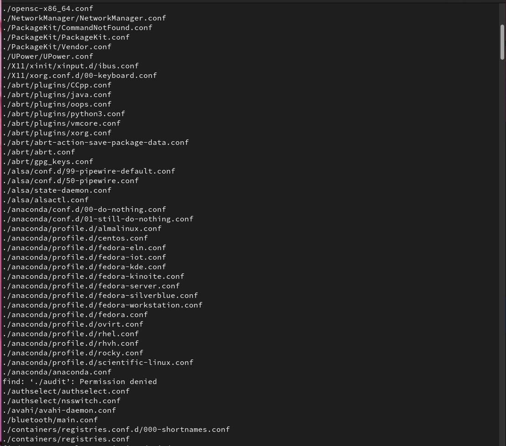
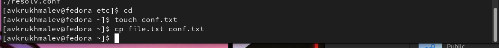
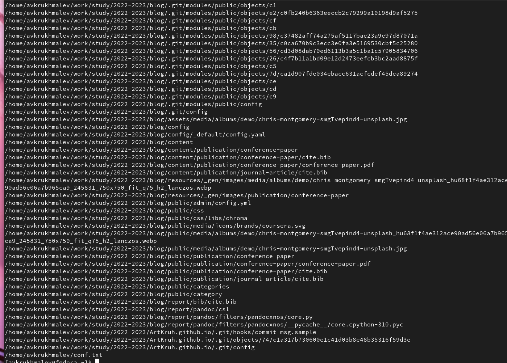
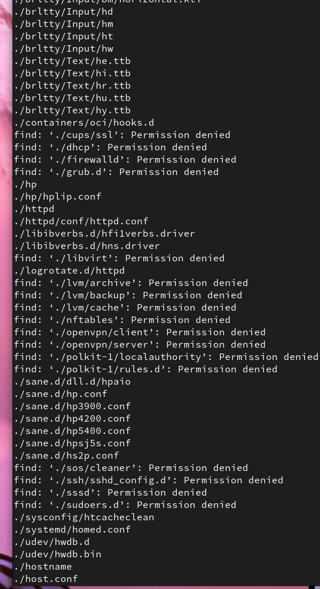
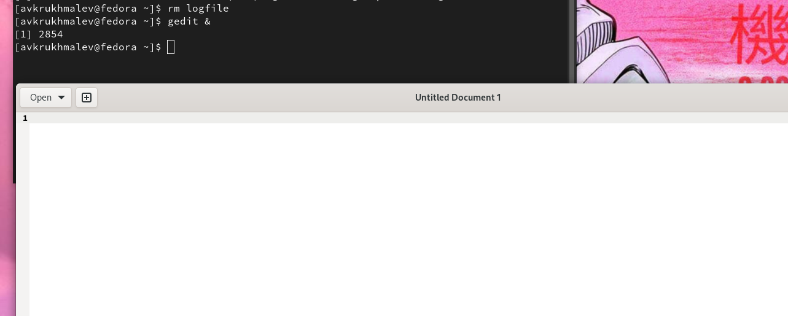
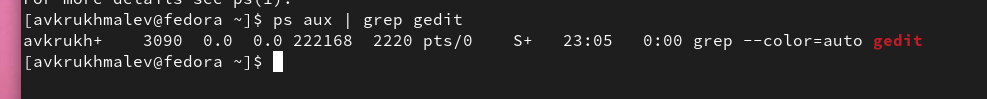
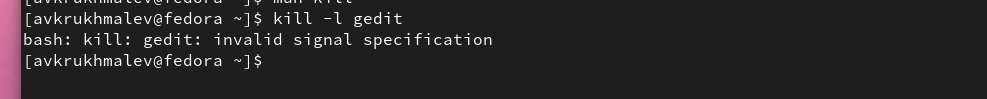
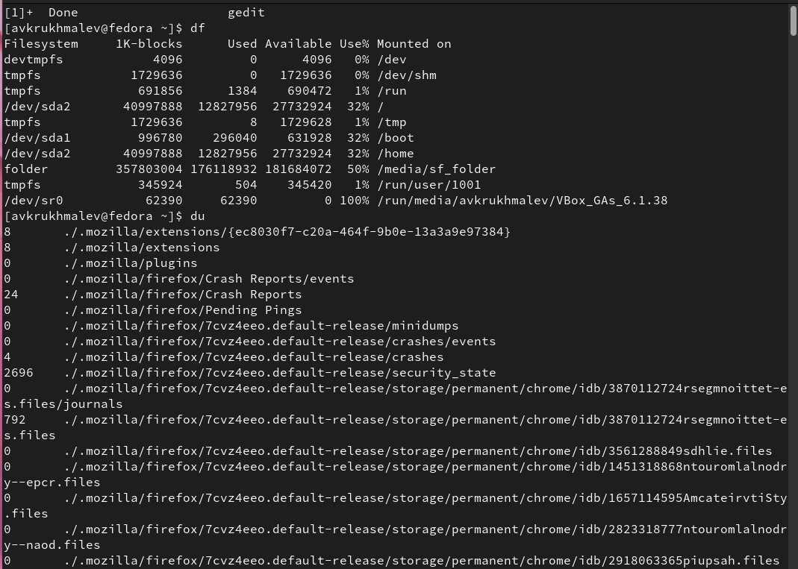
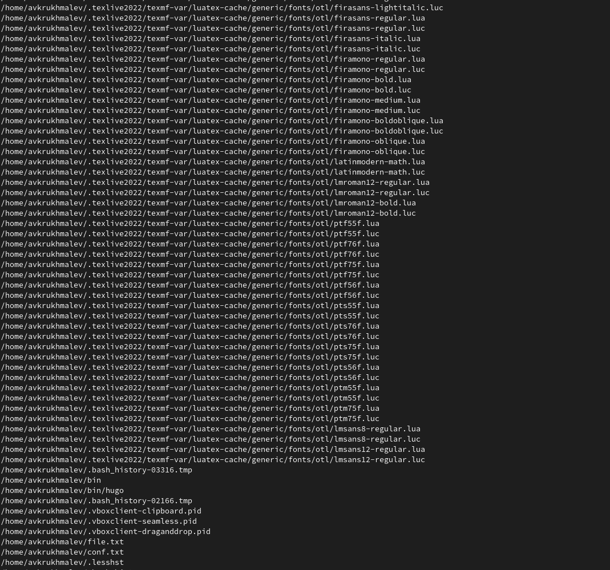

---
## Front matter
lang: ru-RU
title: Лабораторная работа 6
author:
  - Крухмалев А.В.
institute:
  - Российский университет дружбы народов, Москва, Россия
date: 2 марта 2023

## i18n babel
babel-lang: russian
babel-otherlangs: english

## Formatting pdf
toc: false
toc-title: Содержание
slide_level: 2
aspectratio: 169
section-titles: true
theme: metropolis
header-includes:
 - \metroset{progressbar=frametitle,sectionpage=progressbar,numbering=fraction}
 - '\makeatletter'
 - '\beamer@ignorenonframefalse'
 - '\makeatother'
---

## Цель работы

Ознакомление с инструментами поиска файлов и фильтрации текстовых данных.

## Задание

Приобретение практических навыков: по управлению процессами (и заданиями), по
проверке использования диска и обслуживанию файловых систем.

# Выполнение лабораторной работы

## Cоздадим файл file.txt добавим в него все названия файлов из home и etc 

{ #fig:001 width=50% }

## Скопируем файлы .conf в файл conf.txt

{ #fig:002 width=50% }

## Выведем все файлы на букву С

{ #fig:003 width=50% }

## Далее выведем все файлы на h из etc постранично

{ #fig:004 width=50% }

## Запустим в фоновом режиме запись всех файлов с концом на log 

![Фоновый режим] (image/5.png){ #fig:005 width=50% }

## Удалим logfile и запустим gedit в фоновом режиме

{ #fig:006 width=50% }

## Определим идентификатор процесса gedit, используя команду ps, конвейер и фильтр
grep.

{ #fig:007 width=50% }

## Прочитаем справку по kill и выключим gedit, если выключить его заранее то будет ошибка.

{ #fig:009 width=50% }

## Выполним команды df и du, предварительно получив более подробную информацию об этих командах, с помощью команды man.

{ #fig:010 width=50% }

## Воспользовавшись справкой команды find, выведим имена всех директорий, имеющихся в нашем домашнем каталоге.

{ #fig:011 width=50% }

## Выводы

Я приобрел практические навыки: по управлению процессами (и заданиями), попроверке использования диска и обслуживанию файловых систем.

