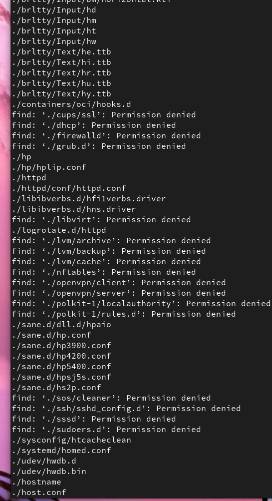
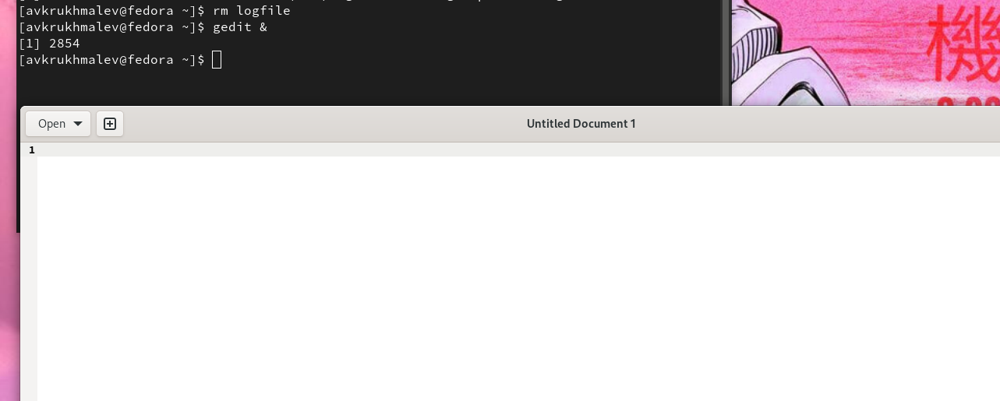
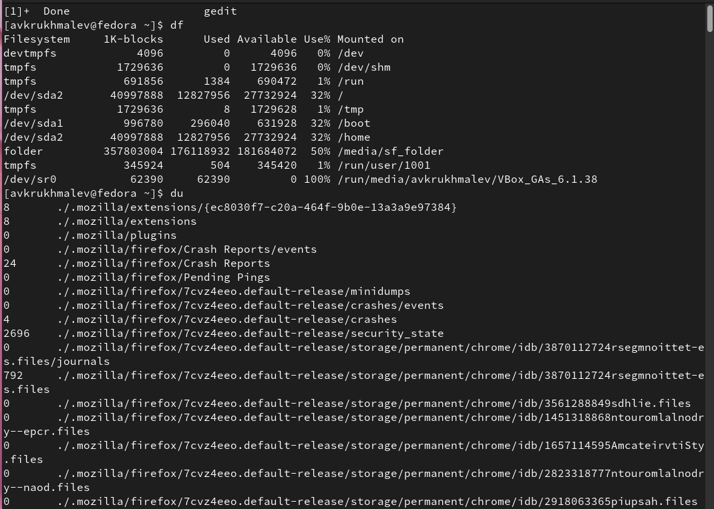
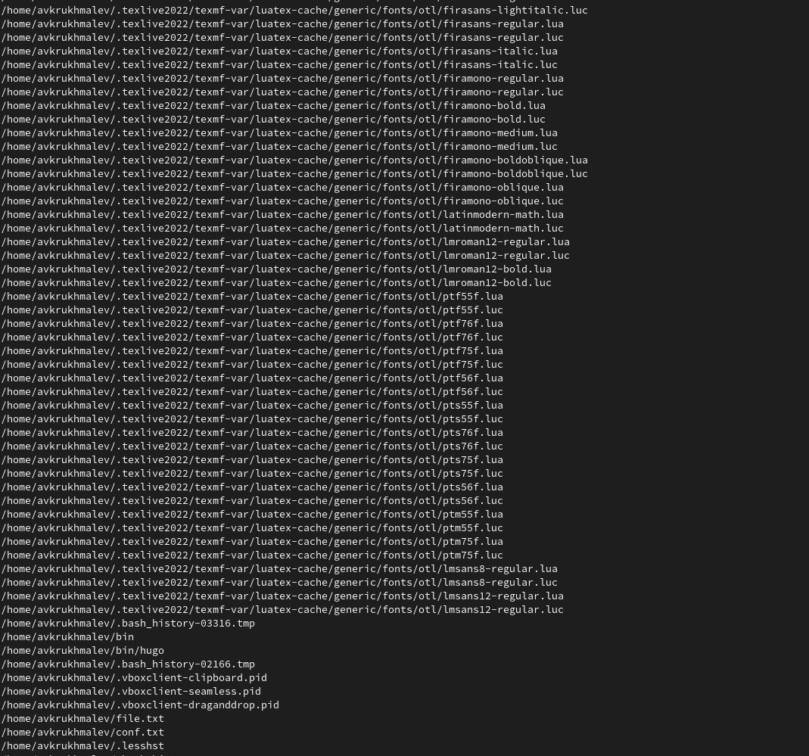

---
## Front matter
title: "Лаборная работа №6"
subtitle: "НММ-бд-02-22"
author: "Крухмалев Артём Владиславович"

## Generic otions
lang: ru-RU
toc-title: "Содержание"

## Bibliography
bibliography: bib/cite.bib
csl: pandoc/csl/gost-r-7-0-5-2008-numeric.csl

## Pdf output format
toc: true # Table of contents
toc-depth: 2
fontsize: 12pt
linestretch: 1.5
papersize: a4
documentclass: scrreprt
## I18n polyglossia
polyglossia-lang:
  name: russian
  options:
	- spelling=modern
	- babelshorthands=true
polyglossia-otherlangs:
  name: english
## I18n babel
babel-lang: russian
babel-otherlangs: english
## Fonts
mainfont: PT Serif
romanfont: PT Serif
sansfont: PT Sans
monofont: PT Mono
mainfontoptions: Ligatures=TeX
romanfontoptions: Ligatures=TeX
sansfontoptions: Ligatures=TeX,Scale=MatchLowercase
monofontoptions: Scale=MatchLowercase,Scale=0.9
## Biblatex
biblatex: false
biblio-style: "gost-numeric"
biblatexoptions:
  - parentracker=true
  - backend=biber
  - hyperref=auto
  - language=auto
  - autolang=other*
  - citestyle=gost-numeric
## Pandoc-crossref LaTeX customization
figureTitle: "Рис."
tableTitle: "Таблица"
listingTitle: "Листинг"
lofTitle: "Список иллюстраций"
lotTitle: "Список таблиц"
lolTitle: "Листинги"
## Misc options
indent: true
header-includes:
  - \usepackage{indentfirst}
  - \usepackage{float} # keep figures where there are in the text
  - \floatplacement{figure}{H} # keep figures where there are in the text
---

# Цель работы

Ознакомление с инструментами поиска файлов и фильтрации текстовых данных.

# Задание

Приобретение практических навыков: по управлению процессами (и заданиями), по
проверке использования диска и обслуживанию файловых систем.

# Выполнение лабораторной работы

1. Cоздадим файл file.txt добавим в него все названия файлов из home и etc 

{ #fig:001 width=70% }

2. Скопируем файлы .conf в файл conf.txt

{ #fig:002 width=70% }

3. Выведем все файлы на букву С

{ #fig:003 width=70% }

4. Далее выведем все файлы на h из etc постранично

{ #fig:004 width=70% }

5. Запустим в фоновом режиме запись всех файлов с концом на log 

![Фоновый режим] (image/5.png){ #fig:005 width=70% }

6. Удалим logfile и запустим gedit в фоновом режиме

{ #fig:006 width=70% }

7. Определим идентификатор процесса gedit, используя команду ps, конвейер и фильтр
grep.

{ #fig:007 width=70% }

8. Прочитаем справку по kill и выключим gedit, если выключить его заранее то будет ошибка.

{ #fig:009 width=70% }

9. Выполним команды df и du, предварительно получив более подробную информацию
об этих командах, с помощью команды man.

{ #fig:010 width=70% }

10. Воспользовавшись справкой команды find, выведим имена всех директорий, имеющихся в нашем домашнем каталоге.

{ #fig:011 width=70% }

# Контрольные вопросы

1. Какие потоки ввода вывода вы знаете?

Stdin и stdout, stderr

2. Объясните разницу между операцией > и >>.

Первый перенаправляет, а второй открывает в режиме добавления.

3. Что такое конвейер?

Конвейер (pipe) служит для объединения простых команд или утилит в цепочки, в которых результат работы предыдущей команды передаётся последующей.

4. Что такое процесс? Чем это понятие отличается от программы?

Компьютерная программа сама по себе — лишь пассивная последовательность инструкций. В то время как процесс — непосредственное выполнение этих инструкций. Также, процессом называют выполняющуюся программу и все её элементы: адресное пространство, глобальные переменные, регистры, стек, открытые файлы и так далее.

5. Что такое PID и GID?

PID – это айди процесса.

GID - Группы пользователей применяются для организации доступа нескольких пользователей к некоторым ресурсам.

6. Что такое задачи и какая команда позволяет ими управлять?

Любую выполняющуюся в консоли команду или внешнюю программу можно запустить в фоновом режиме. Для этого следует в конце имени команды указать знак амперсанда &. Например: gedit &.

7. Найдите информацию об утилитах top и htop. Каковы их функции?

Top - отобразить запущенные процессы, используемые ими ресурсы и другую полезную информацию (с автоматическим обновлением данных)

Htop - показывает динамический список системных процессов, список обычно выравнивается по использованию ЦПУ. В отличие от top, htop показывает все процессы в системе. Также показывает время непрерывной работы, использование процессоров и памяти. Htop часто применяется в тех случаях, когда информации даваемой утилитой top недостаточно, например при поиске утечек памяти в процессах.

8. Назовите и дайте характеристику команде поиска файлов. Приведите примеры использования этой команды.

Команда find используется для поиска и отображения на экран имён файлов, соответствующих заданной строке символов. Формат команды: find путь [-опции]

9. Можно ли по контексту (содержанию) найти файл? Если да, то как?

Да, через команду grep. Например: grep Aug -R /var/log/* вывода строки, содержащие "Aug", во всех файлах, находящихся в директории /var/log и ниже

10. Как определить объем свободной памяти на жёстком диске?

Для определения объёма свободного пространства на файловой системе можно воспользоваться командой df, которая выведет на экран список всех файловых систем в соответствии с именами устройств, с указанием размера и точки монтирования.

11. Как определить объем вашего домашнего каталога?

Команда du показывает число килобайт, используемое каждым файлом или каталогом.

12. Как удалить зависший процесс?

Можно удалить через kill, написав айди процесса

# Выводы

Я приобрел практические навыки: по управлению процессами (и заданиями), попроверке использования диска и обслуживанию файловых систем.
