---
## Front matter
lang: ru-RU
title: Лабораторная работа 7
author:
  - Крухмалев А.В.
institute:
  - Российский университет дружбы народов, Москва, Россия
date: 2 марта 2023

## i18n babel
babel-lang: russian
babel-otherlangs: english

## Formatting pdf
toc: false
toc-title: Содержание
slide_level: 2
aspectratio: 169
section-titles: true
theme: metropolis
header-includes:
 - \metroset{progressbar=frametitle,sectionpage=progressbar,numbering=fraction}
 - '\makeatletter'
 - '\beamer@ignorenonframefalse'
 - '\makeatother'
---

## Цель работы

Освоение основных возможностей командной оболочки Midnight Commander.

## Задание

Приобретение навыков практической работы по просмотру каталогов и файлов; манипуляций с ними.

# Выполнение лабораторной работы

## Запустим мс после его изучения

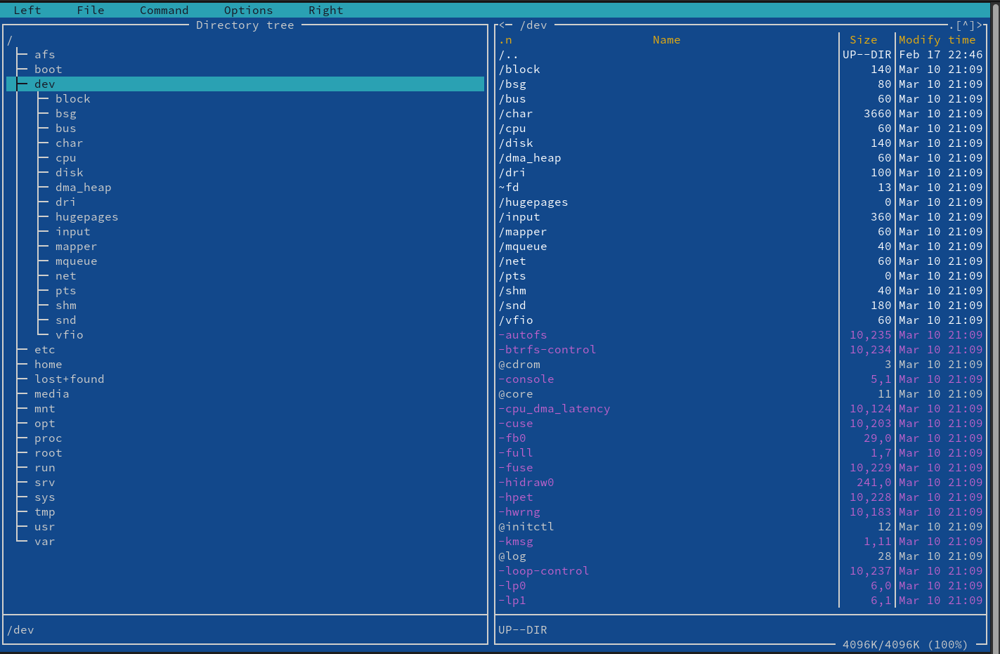{ #fig:001 width=70% }

## Попробуем поделать разные команды

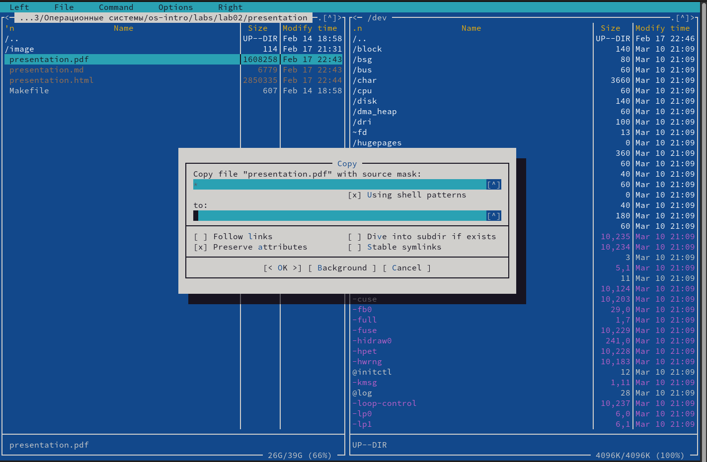{ #fig:002 width=40% }

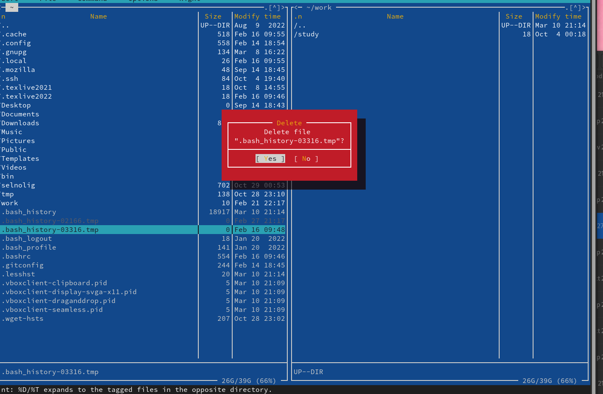{ #fig:015 width=40% }

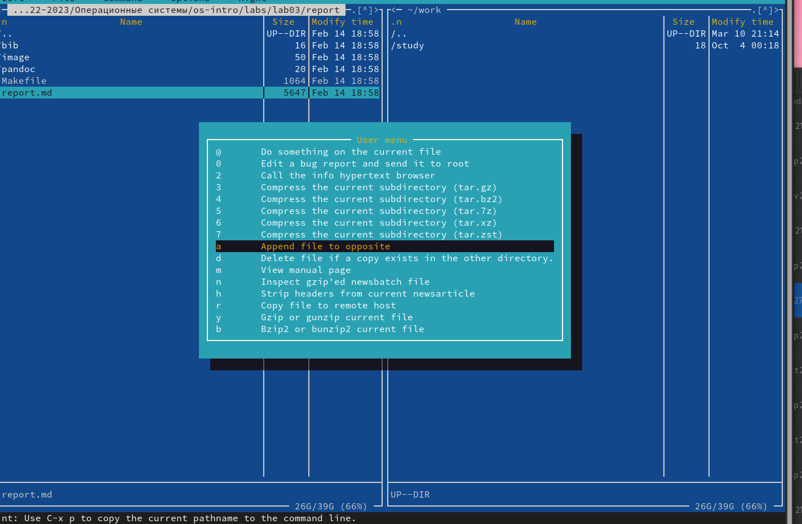{ #fig:016 width=40% }

## Теперь выведем информацию о файле,  

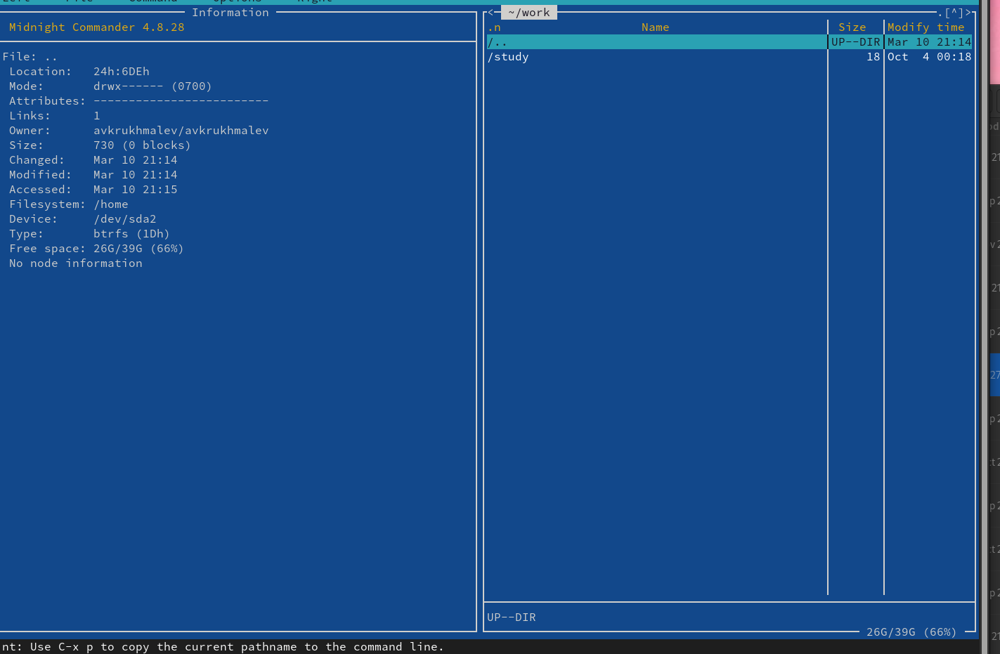{ #fig:003 width=70% }

## Откроем с помощью меню файл

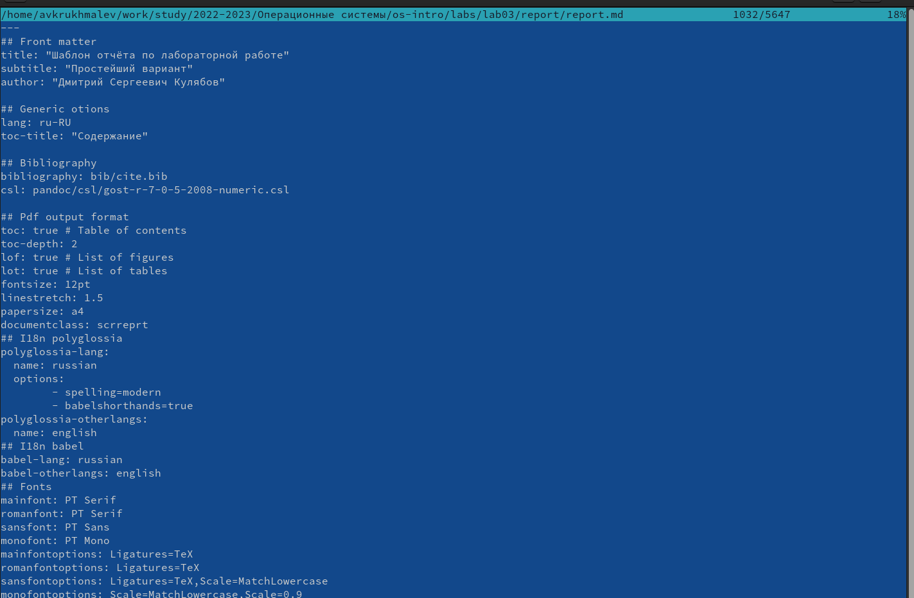{ #fig:004 width=70% }

## Создадим каталог с помощью консоли

![Каталог] (image/7.png){ #fig:005 width=40% }

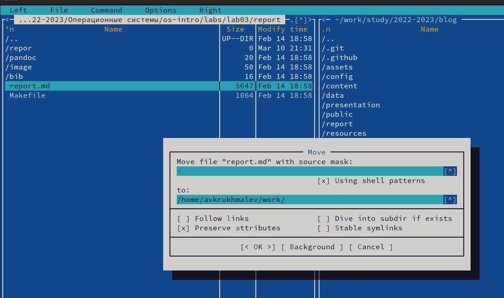{ #fig:017 width=40% }

## Найдем все файлы репор мд

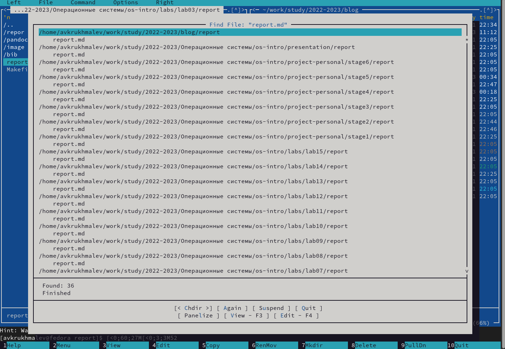{ #fig:006 width=70% }

## С помощбю верхней понели откроем историю команд и выполним прошлую

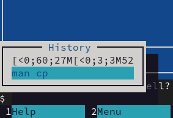{ #fig:007 width=70% }

## Меню опций

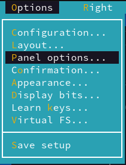{ #fig:009 width=70% }

## Скопируем текст из интернета и начнем с ним работать, для начала скопируем часть текста.

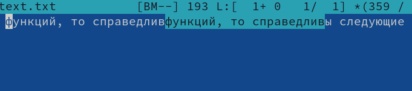{ #fig:010 width=70% }

## Функции бэкапа

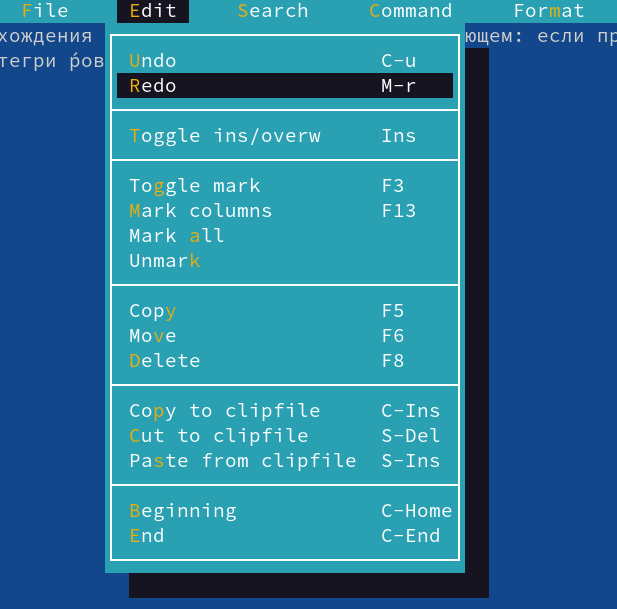{ #fig:011 width=70% }

## Функции перехода в начало и коннец текста

{ #fig:011 width=70% }

## Подсветка кода

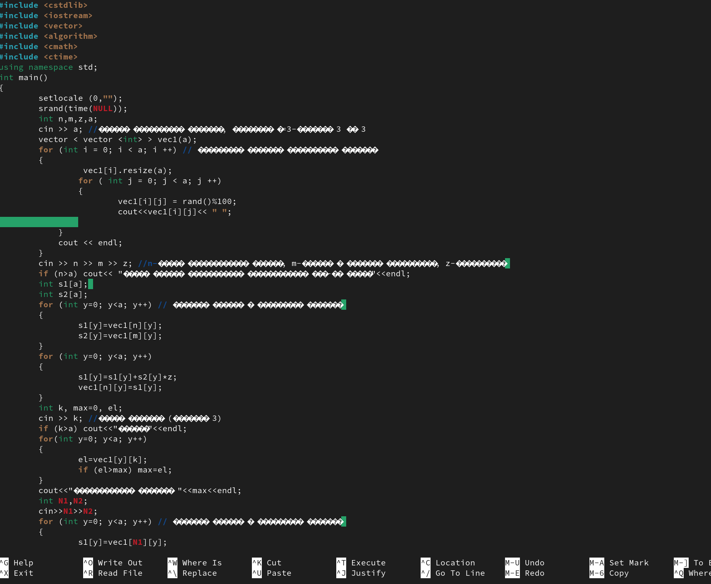{ #fig:011 width=70% }

## Выводы

Я приобрел практические навыки работы по просмотру каталогов и файлов; манипуляций с ними.

