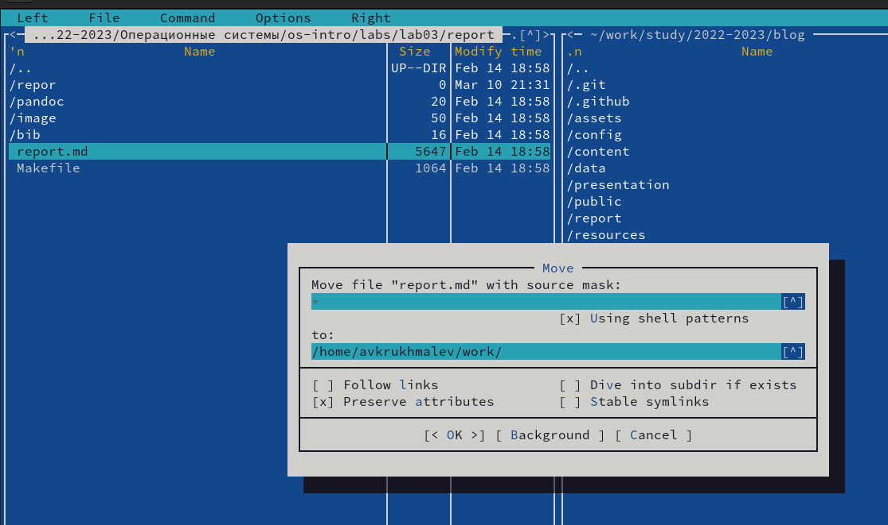
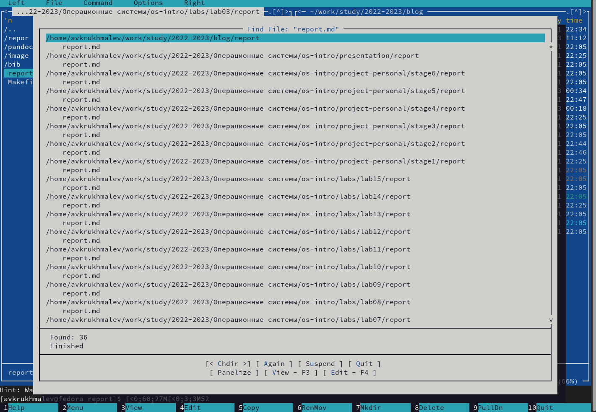
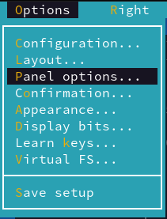

---
## Front matter
title: "Лаборная работа №7"
subtitle: "НММ-бд-02-22"
author: "Крухмалев Артём Владиславович"

## Generic otions
lang: ru-RU
toc-title: "Содержание"

## Bibliography
bibliography: bib/cite.bib
csl: pandoc/csl/gost-r-7-0-5-2008-numeric.csl

## Pdf output format
toc: true # Table of contents
toc-depth: 2
fontsize: 12pt
linestretch: 1.5
papersize: a4
documentclass: scrreprt
## I18n polyglossia
polyglossia-lang:
  name: russian
  options:
	- spelling=modern
	- babelshorthands=true
polyglossia-otherlangs:
  name: english
## I18n babel
babel-lang: russian
babel-otherlangs: english
## Fonts
mainfont: PT Serif
romanfont: PT Serif
sansfont: PT Sans
monofont: PT Mono
mainfontoptions: Ligatures=TeX
romanfontoptions: Ligatures=TeX
sansfontoptions: Ligatures=TeX,Scale=MatchLowercase
monofontoptions: Scale=MatchLowercase,Scale=0.9
## Biblatex
biblatex: false
biblio-style: "gost-numeric"
biblatexoptions:
  - parentracker=true
  - backend=biber
  - hyperref=auto
  - language=auto
  - autolang=other*
  - citestyle=gost-numeric
## Pandoc-crossref LaTeX customization
figureTitle: "Рис."
tableTitle: "Таблица"
listingTitle: "Листинг"
lofTitle: "Список иллюстраций"
lotTitle: "Список таблиц"
lolTitle: "Листинги"
## Misc options
indent: true
header-includes:
  - \usepackage{indentfirst}
  - \usepackage{float} # keep figures where there are in the text
  - \floatplacement{figure}{H} # keep figures where there are in the text
---

# Цель работы

Освоение основных возможностей командной оболочки Midnight Commander.

# Задание

Приобретение навыков практической работы по просмотру каталогов и файлов; манипуляций с ними.

# Выполнение лабораторной работы

1. Запустим мс после его изучения

{ #fig:001 width=70% }

2. Попробуем поделать разные команды

{ #fig:002 width=70% }

{ #fig:015 width=70% }

{ #fig:016 width=70% }

3. Теперь выведем информацию о файле,  

{ #fig:003 width=70% }

4. Откроем с помощью меню файл

{ #fig:004 width=70% }

5. Создадим каталог с помощью консоли

![Каталог] (image/7.png){ #fig:005 width=70% }

{ #fig:017 width=70% }

6. Найдем все файлы репор мд

{ #fig:006 width=70% }

7. С помощбю верхней понели откроем историю команд и выполним прошлую

{ #fig:007 width=70% }

8. Меню опций

{ #fig:009 width=70% }

9. Скопируем текст из интернета и начнем с ним работать, для начала скопируем часть текста.

{ #fig:010 width=70% }

10. Функции бэкапа

{ #fig:011 width=70% }

11. Функции перехода в начало и коннец текста

{ #fig:011 width=70% }

10. Подсветка кода

{ #fig:011 width=70% }

# Контрольные вопросы

1. Какие режимы работы есть в mc. Охарактеризуйте их.
mc - визуальная файловая оболочка для UNIX/Linux систем, аналог Far, Norton Commander, но оболочки в Linux несравненно богаче. На языке командной оболочки можно писать небольшие программы для выполнения ряда последовательных операций с файлами и содержащимися в них данными. Команда Переставить панели (Ctrl+U) меняет местами содержимое правой и левой панелей.Команде Отключить панели (Ctrl+O). По команде Сравнить каталоги (Ctrl-X,D) сравнивается содержимое каталогов, отображаемых на левой и правой панелях. Помимо того, что может задаваться формат вывода на панель списка файлов, любую панель можно перевести в один из следующих режимов:

• Режим “Информация”. В этом режиме на панель выводится информация о подсвеченном в другой панели файле и о текущей файловой системе.

• Режим “Дерево”. В режиме отображения дерева каталогов в одной из панелей выводится графическое изображение структуры дерева каталогов. Этот режим подобен тому, который вы увидите, выбрав команду Дерево каталогов из меню Команды, только в последнем случае изображение структуры каталогов выводится в отдельное окно. Левая Панель и Правая Панель меню (левой/правой панели) позволяют оперировать режимами отображения панелей. Меню Левая Панель и Правая Панель позволяют оперировать панелями. Формат списка бывает:

• Стандартный – вывод списка файлов и каталогов по умолчанию;

• Ускоренный – имена файла или каталогов;

• Расширенный – атрибуты, владелец, группа и размер;

• Определённый пользователем – имя, размер и атрибуты; Быстрый просмотр – выполняет быстрый просмотр содержимого панели. Информация – выдает всю имеющуюся информацию о файле или каталоге. Порядок сортировки – бывает: без сортировки, по имени, расширенный, время правки, время правки, время доступа, время изменение атрибута, размер, узел.

2. Какие операции с файлами можно выполнить как с помощью команд shell, так и с помощью меню (комбинаций клавиш) mc? Приведите несколько примеров.
• Системная информация

• Поиск

• Копирование

3. Опишите структура меню левой (или правой) панели mc, дайте характеристику командам.
• Список файлов показывает файлы в домашнем каталоге.

• Быстрый просмотр позволяет выполнить быстрый просмотр содержимого панели.

• Информация позволяет посмотреть информацию о файле или каталоге

• Командная оболочка Midnight Commander В меню каждой (левой или правой) панели можно выбрать Формат списка: стандартный, ускоренный, расширенный и определённый пользователем.

• Порядок сортировки позволяет задать критерии сортировки при выводе списка файлов и каталогов: без сортировки, по имени, расширенный, время правки, время доступа, время изменения атрибута, размер, узел.

4. Опишите структура меню Файл mc, дайте характеристику командам.
• Просмотр ( F3 ) позволяет посмотреть содержимое текущего файла без возможности редактирования.

• Просмотр вывода команды ( М + ! ) функция запроса команды с параметрами.

• Правка ( F4 ) открывает текущий (или выделенный) файл для его редактирования.

• Копирование ( F5 ) осуществляет копирование одного или нескольких файлов или каталогов в указанное пользователем во всплывающем окне место.

• Права доступа ( Ctrl-x c ) позволяет изменить права доступа к одному или нескольким файлам или каталогам.

• Права доступа на файлы и каталоги

• Жёсткая ссылка ( Ctrl-x l ) позволяет создать жёсткую ссылку к текущему (или выделенному) файлу1 .

• Символическая ссылка ( Ctrl-x s ) — позволяет создать символическую ссылку к текущему файлу .

• Владелец группы ( Ctrl-x o ) позволяет задать владельца и имя группы для одного или нескольких файлов или каталогов.

• Права (расширенные) позволяет изменить права доступа и владения для одного или нескольких файлов или каталогов.

• Переименование ( F6 ) позволяет переименовать один или несколько файлов или каталогов.

• Создание каталога ( F7 ) позволяет создать каталог.

• Удалить ( F8 ) позволяет удалить один или несколько файлов или каталогов.

• Выход ( F10 ) завершает работу mc.

5. Опишите структура меню Команда mc, дайте характеристику командам.
• Дерево каталогов отображает структуру каталогов системы.

• Поиск файла выполняет поиск файлов по заданным параметрам.

• Переставить панели меняет местами левую и правую панели.

• Сравнить каталоги ( Ctrl-x d ) сравнивает содержимое двух каталогов.

• Размеры каталогов отображает размер и время изменения каталога (по умол- чанию в mc размер каталога корректно не отображается).

• История командной строки выводит на экран список ранее выполненных в оболочке команд.

• Каталоги быстрого доступа ( Ctrl- ) при вызове выполняется быстрая смена текущего

• каталога на один из заданного списка.

• Восстановление файлов позволяет восстановить файлы на файловых систе- мах ext2 и ext3.

• Редактировать файл расширений позволяет задать с помощью определённого синтаксиса действия при запуске файлов с определённым расширением (напри- мер, какое программного обеспечение запускать для открытия или редактирова- ния файлов с расширением .c или .cpp).

• Редактировать файл меню позволяет отредактировать контекстное меню поль- зователя, вызываемое по клавише F2 .

• Редактировать файл расцветки имён позволяет подобрать оптимальную для пользователя расцветку имён файлов в зависимости от их типа.

6. Опишите структура меню Настройки mc, дайте характеристику командам.
• Конфигурация позволяет скорректировать настройки работы с панелями.

• Внешний вид и Настройки панелей определяет элементы, отображаемые при вызове mc, а также цветовое выделение.

• Биты символов задаёт формат обработки информации локальным термина- лом.

• Подтверждение позволяет установить или убрать вывод окна с запросом подтверждения действий при операциях удаления и перезаписи файлов, а также при выходе из программы.

• Распознание клавиш диалоговое окно используется для тестирования функциональных клавиш, клавиш управления курсором и прочее.

• Виртуальные ФС настройки виртуальной файловой системы: тайм-аут, пароль и прочее.

7. Назовите и дайте характеристику встроенным командам mc.
• F1 Вызов контекстно-зависимой подсказки.

• F2 Вызов пользовательского меню с возможностью создания and/or.

• F3 Просмотр содержимого файла, на который указывает подсветка в активной панели.

• F4 Вызов встроенного в mc редактора для изменения содержания файла, на который

• указывает подсветка в активной панели.

• F5 Копирование одного или нескольких файлов, отмеченных в первой (активной) панели, в каталог, отображаемый на второй панели.

• F6 Перенос одного или нескольких файлов, отмеченных в первой панели, в каталог, отображаемый на второй панели.

• F7 Создание подкаталога в каталоге, отображаемом в активной панели.

• F8 Удаление одного или нескольких файлов, отмеченных в первой панели файлов.

• F9 Вызов меню mc.

• F10 Выход из mc.

8. Назовите и дайте характеристику командам встроенного редактора mc.
• Ctrl+y удалить строку.

• Ctrl+u отмена последней операции.

• Ins вставка/замена.

• F7 поиск.

• Shift+F7 повтор последней операции поиска.

• F4 замена файла.

• F3 первое нажатие начало выделения, второе это окончание выделения.

• F5 копировать выделенный фрагмент F6 переместить выделенный фрагмент.

• F8 удалить выделенный фрагмент.

• F2 записать изменения в файл.

• F10 выйти из редактора.

9. Дайте характеристику средствам mc, которые позволяют создавать меню, определяемые пользователем.
Один из четырех форматов списка в Midnight Commander –пользовательский, определённый самим пользователем позволяет ему редактировать меню любого из двух списков. А меню пользователя – это меню, состоящее из команд, определенных пользователем. При вызове меню используется файл ~/.mc.menu. Если такого файла нет, то по умолчанию используется системный файл меню /usr/lib/mc/mc.menu. Все строки в этих файлах , начинающиеся с пробела или табуляции, являются командами, которые выполняются при выборе записи.

10. Дайте характеристику средствам mc, которые позволяют выполнять действия, определяемые пользователем, над текущим файлом.
Когда мы выделяем файл не являющегося исполняемым, Midnight Commander сравнивает расширение выбранного файла с расширениями, прописанными в «файле расширений» ~/ mc.ext. Если в файле расширений найдется подраздел, задающий процедуры обработки файлов с данным расширением, то обработка файла производится в соответствии с заданными в этом подразделе командами и файлами:

• файл помощи для MC. /usr/lib/mc.hlp

• файл расширений, используемый по умолчанию. /usr/lib/mc/mc.ext

• файл расширений, конфигурации редактора. $HOME/.mc.ext

• системный инициализационный файл. /usr/lib/mc/mc.ini

• фаил который содержит основные установки. /usr/lib/mc/mc.lib

• инициализационный файл пользователя. Если он существует, то системный файл mc.ini игнорируется. $HOME/.mc.ini

• этот файл содержит подсказки, отображаемые в нижней части экрана. /usr/lib/mc/mc.hint

• системный файл меню MC, используемый по умолчанию. /usr/lib/mc/mc.menu

• файл меню пользователя. Если он существует, то системный файл меню игнорируется. $HOME/.mc.menu

• инициализационный файл пользователя. Если он существует, то системный файл mc.ini игнорируется. $HOME/.mc.tree

# Выводы

Я приобрел практические навыки работы по просмотру каталогов и файлов; манипуляций с ними.
