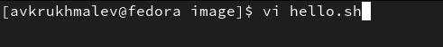
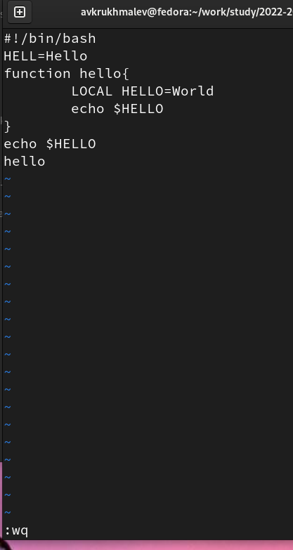
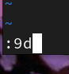
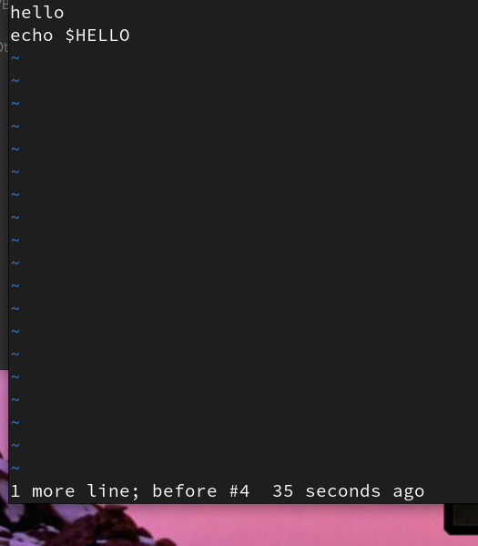

---
## Front matter
lang: ru-RU
title: Лабораторная работа 8
author:
  - Крухмалев А.В.
institute:
  - Российский университет дружбы народов, Москва, Россия
date: 11 марта 2023

## i18n babel
babel-lang: russian
babel-otherlangs: english

## Formatting pdf
toc: false
toc-title: Содержание
slide_level: 2
aspectratio: 169
section-titles: true
theme: metropolis
header-includes:
 - \metroset{progressbar=frametitle,sectionpage=progressbar,numbering=fraction}
 - '\makeatletter'
 - '\beamer@ignorenonframefalse'
 - '\makeatother'
---

## Цель работы

Познакомиться с операционной системой Linux. Получить практические навыки работы с редактором vi, установленным по умолчанию практически во всех дистрибутивах.

## Задание

Создать файл и отредактировать его.

# Выполнение лабораторной работы

## Вызовем vi и создадим новый файл

{ #fig:001 width=70% }

## Скопируем предложенный текст в файл, затем сохраним его с помощбю команды :wq

{ #fig:002 width=70% }

## Нажмем I и проделаем часть хамен текста, также удалим строку 9 с помощью команды :9d

{ #fig:003 width=70% }

## Вернем удаленную строку с помощью команды u

{ #fig:004 width=70% }

## Теперь выйдем и сохраним файл, если написать в последней строке какой-то текст то выведется ошибка.

![Ошибка] (image/5.png){ #fig:005 width=70% }

## Выводы

Я приобрел практические навыки по работе с vi.

