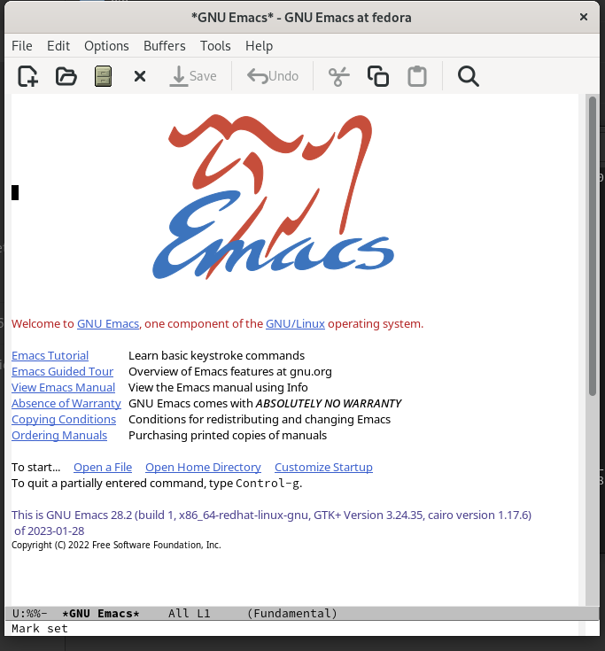
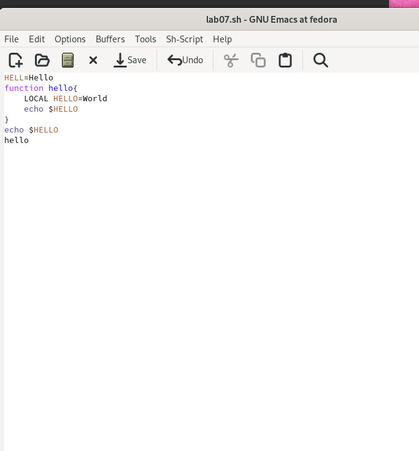
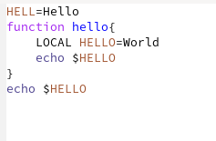
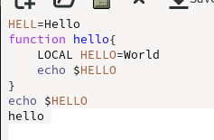
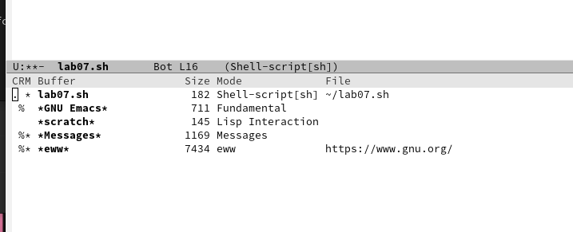
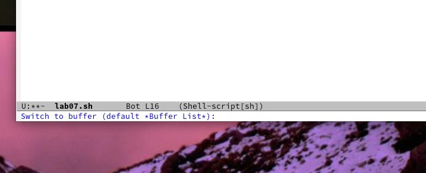
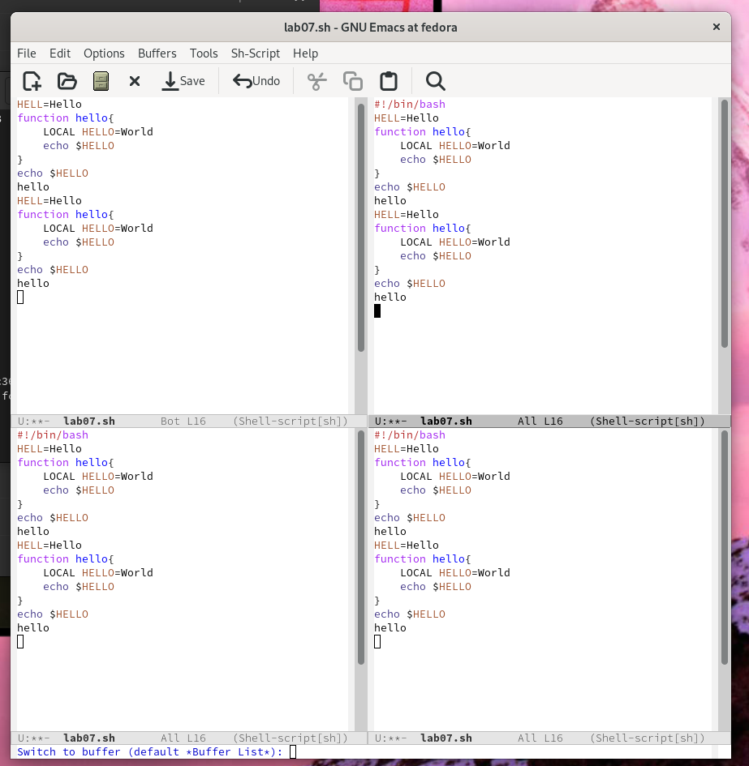
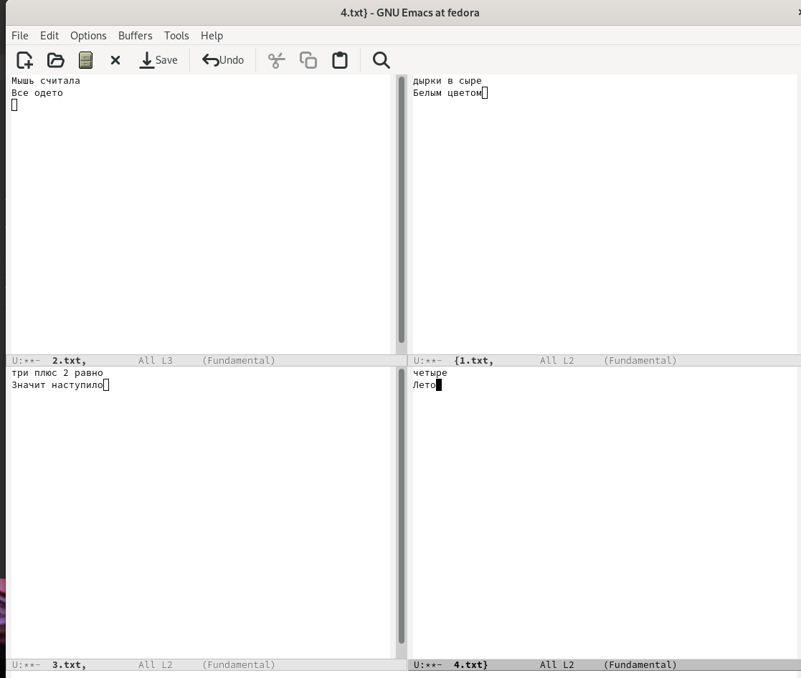
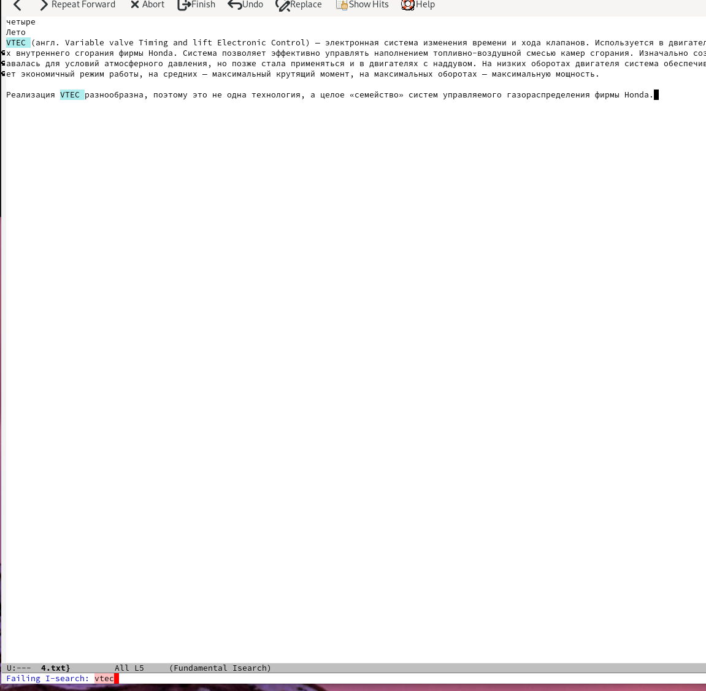
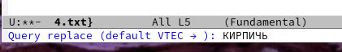

---
## Front matter
lang: ru-RU
title: Лабораторная работа 9
author:
  - Крухмалев А.В.
institute:
  - Российский университет дружбы народов, Москва, Россия
date: 13 марта 2023

## i18n babel
babel-lang: russian
babel-otherlangs: english

## Formatting pdf
toc: false
toc-title: Содержание
slide_level: 2
aspectratio: 169
section-titles: true
theme: metropolis
header-includes:
 - \metroset{progressbar=frametitle,sectionpage=progressbar,numbering=fraction}
 - '\makeatletter'
 - '\beamer@ignorenonframefalse'
 - '\makeatother'
---

## Цель работы

Познакомиться с операционной системой Linux. Получить практические навыки рабо-
ты с редактором Emacs.

## Задание

Создать файл. Отредактировать его.

# Выполнение лабораторной работы

## Скачаем необходимое ПО, и создадим файл.

{ #fig:001 width=70% }

## ВВедем текст 

{ #fig:002 width=70% }

## Начнем редактировать файл. удалим строку (С-к)

{ #fig:003 width=70% }

## Вставка строки (С-v)

{ #fig:004 width=70% }

## Выделим область и вставим в конец текста

![Выделение области] (image/5.png){ #fig:005 width=70% }

## Далее поуправляем курсорами и перейдем к буферам (С-х С-б)

{ #fig:006 width=70% }

## Переключимся на другой буфер

{ #fig:007 width=70% }

## Откроем 4 окна 

{ #fig:009 width=70% }

## В каждом откроем новый буфер и напишем там текст

{ #fig:010 width=70% }

## Начнем поиск и найдем слово

{ #fig:011 width=70% }

## Заменим текст после поиска с помощбю 2 режимов. 

В первом случае, результаты показан в тексте. Во втором-в отдельном окне.

{ #fig:011 width=70% }

## Выводы

Познакомился с операционной системой Linux. Получил практические навыки работы с редактором Emacs. 

