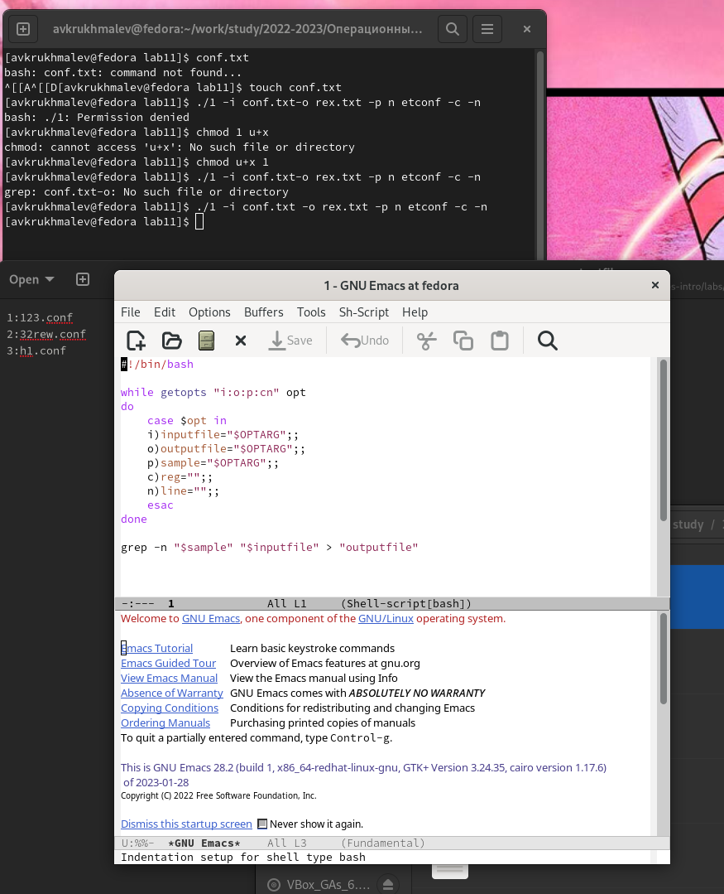
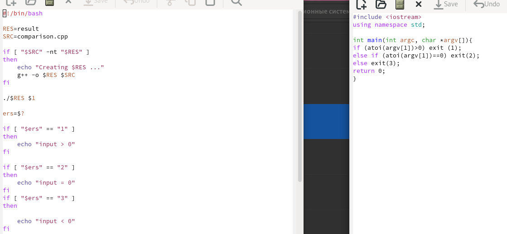
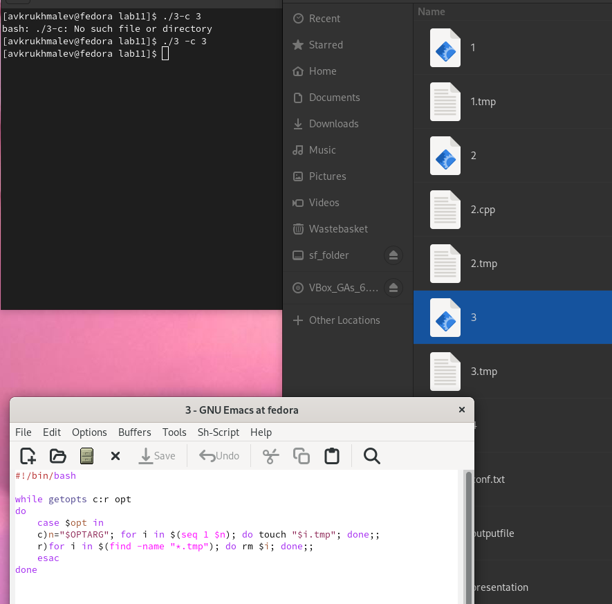
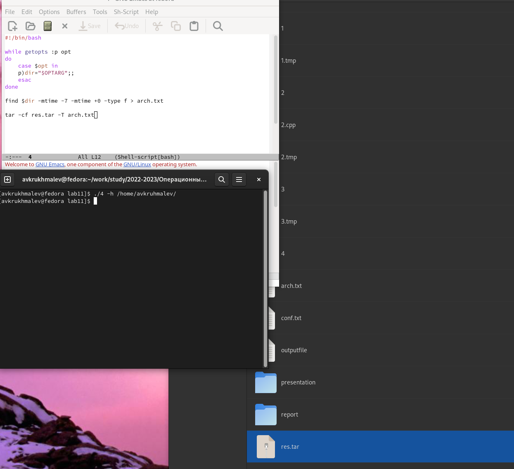

---
## Front matter
lang: ru-RU
title: Лабораторная работа 11
author:
  - Крухмалев А.В.
institute:
  - Российский университет дружбы народов, Москва, Россия
date: 13 фпреля 2023

## i18n babel
babel-lang: russian
babel-otherlangs: english

## Formatting pdf
toc: false
toc-title: Содержание
slide_level: 2
aspectratio: 169
section-titles: true
theme: metropolis
header-includes:
 - \metroset{progressbar=frametitle,sectionpage=progressbar,numbering=fraction}
 - '\makeatletter'
 - '\beamer@ignorenonframefalse'
 - '\makeatother'
---

## Цель работы

Изучить основы программирования в оболочке ОС UNIX/Linux. Научиться писать командные файлы.

## Задание

Написать программы

# Выполнение лабораторной работы

##Первая программа-анализирует командную строку с ключами 

{ #fig:001 width=70% }

## Вторая программа

{ #fig:002 width=70% }

## Третья программа-программа создает указанное чило пустыч файлов

{ #fig:003 width=70% }

## Четвертая программа-файл запаковывает измененные неделю или больше назад

{ #fig:004 width=70% }

## Выводы

Научился писать небольшие командные файлы

